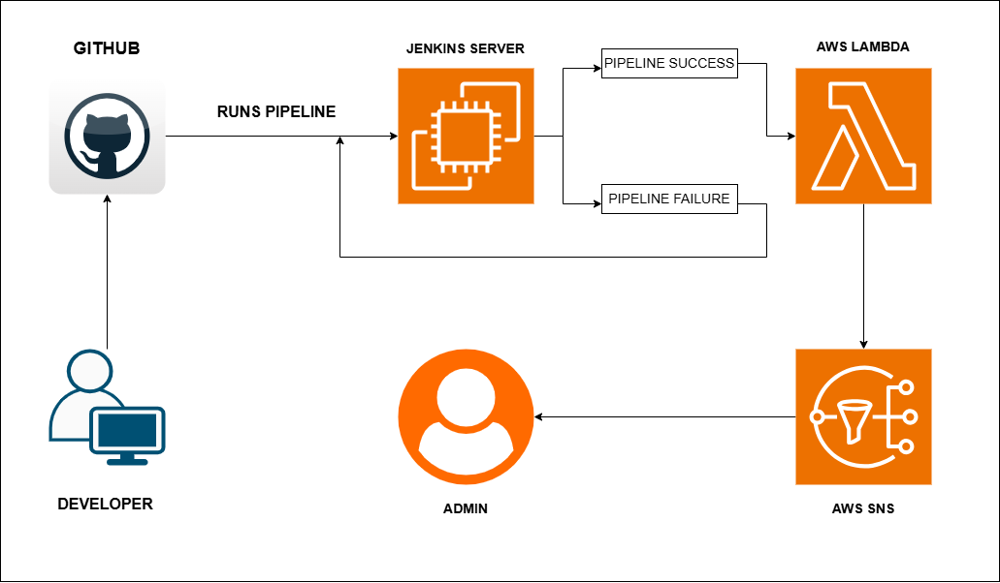

# Title: Automated Docker Image Deployment to Amazon ECR with Jenkins and Lambda Integration.

**Objective:**
Design a CI/CD pipeline using Jenkins that automatically builds and pushes a Docker
image to Amazon ECR (Elastic Container Registry) whenever the application code
is updated or the Docker image is rebuilt. Once the image is pushed, an AWS
Lambda function should be invoked to perform post-deployment tasks (e.g.,
logging, notification, or further automation).

## Architecture Diagram



## Deployment Steps

### 1. GitHub files

- Create a Repository named as `Automated Docker Image Deployment to Amazon ECR with Jenkins and Lambda Integration` .
- Push following files to GitHub `main` branch.

```html
Public/
app.js
package.json
Dockerfile
jenkinsfile
```

### 2. AWS Infrastructure Prerequisites

- **ECR:** Create a private container repository named `automated-docker-image-deployment` in your  region.
- **SNS:** Create a Standard SNS Topic named `ecr-deployment-noti`. Create an **Email Subscription** pointing to your destination email, then check your inbox to click the **Confirm Subscription** verification link.
- **IAM:** Create an IAM Role named as `Jenkins-ECR-Role`  for your Lambda function allowing `AmazonEC2ContainerRegistryPowerUser`  access to your topic ARN.

### 3. Configure AWS Lambda Function

- Create a Python Lambda function named as `ecr-deployment-log` and deploy the lambda function code.

### 4. Launch EC2 instance and setup

- Launch EC2 instance named as `Jenkins server` .
    
    *(Instance type : `t3.small` .t3.micro will get crashed because of load.)*
    
- Ensure Docker*(To test manually)* , Jenkins and AWS CLI are installed on Jenkins server.
- Setup everything on Jenkins server. Install **Git**, **SSH Agent** and **Pipeline** plugin on it.
- Add the `jenkins` user to the `docker` system group:

```html
 sudo usermod -aG docker jenkins && sudo systemctl restart jenkins
```

- Add GitHub Personal Access Token(PAT) to Jenkins credentials as `username with password`.

### 5. Create CI/CD pipeline job

- Open Jenkins dashboard and click on **new item**.
- Name the project and select Pipeline, then click OK.
- Under the **Pipeline Definition**, change the drop-down to **Pipeline script from SCM**.
- Configure the repository URL and change branch to **`/main`.**
- Click **Save** and select **Build Now** to run  automated deployment.

---

## Explanation of each component

**GITHUB:** Acts as source code management system. It holds sample application code and declarative Jenkinsfile.

**Jenkins:** CI/CD pipeline running on EC2 instance. It pulls source code from github, builds docker image and push to AWS ECR using AWS CLI.

**Docker:** Installed on Jenkins server. Used Docker to test image manually. It handles fast containerization. 

**AWS ECR (Amazon Elastic Container Registry):** Highly available, securely managed by AWS docker registry. Hosts production ready docker images with tags control (latest).

**IAM (Identity Access Management):** Used to manage access of users. Assign role and attach policies to services. Created a role for AWS Lambda to access AWS ECR Private repository with policy. 

**AWS Lambda:** A serverless, event-driven compute function written in python. Used to trigger the SNS service after a successful CI/CD.

**AWS SNS (Simple Notification Service):** A publish messaging architecture used to configure to successful pipeline  execution and sends summary to verified administrative email.

---

## Sample logs or screenshots of image push and Lambda execution

.png)

.png)

.png)

.png)

.png)

.png)